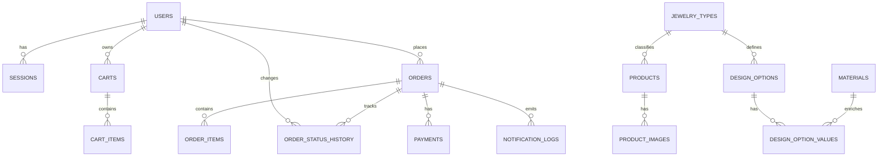

# Database Architecture

## Общие принципы

- Основная СУБД: `MySQL 8+`.
- Временная зона хранения: `UTC`.
- Денежные значения: `DECIMAL(10,2)`.
- Все бизнес-идентификаторы заказа формируются на сервере.
- Для словарных сущностей хранятся поля локализации `*_uk` и `*_en`.
- Удаление в MVP выполняется через `is_active`, а не через физическое удаление, если данные участвуют в истории заказов.

## ER-модель



## Таблицы доступа и идентичности

### `users`

| Поле | Тип | Примечание |
| --- | --- | --- |
| `id` | `BIGINT PK` | внутренний идентификатор |
| `role` | `ENUM('client','admin')` | роль пользователя |
| `full_name` | `VARCHAR(255)` | имя для заказа и профиля |
| `email` | `VARCHAR(255) UNIQUE` | логин |
| `phone` | `VARCHAR(50)` | контактный номер |
| `password_hash` | `VARCHAR(255)` | только хэш |
| `preferred_locale` | `ENUM('uk','en')` | язык интерфейса |
| `is_active` | `BOOLEAN` | для блокировки учётной записи |
| `created_at` | `DATETIME` | дата создания |
| `updated_at` | `DATETIME` | дата изменения |

### `sessions`

| Поле | Тип | Примечание |
| --- | --- | --- |
| `id` | `CHAR(36) PK` | UUID сессии |
| `user_id` | `BIGINT FK -> users.id` | владелец сессии |
| `token_hash` | `VARCHAR(255)` | хэш токена cookie |
| `ip_address` | `VARCHAR(64)` | аудит |
| `user_agent` | `VARCHAR(512)` | аудит |
| `expires_at` | `DATETIME` | срок действия |
| `created_at` | `DATETIME` | дата создания |

## Таблицы каталога и конструктора

### `jewelry_types`

Типы изделий, для которых работает конструктор и каталог.

| Поле | Тип | Примечание |
| --- | --- | --- |
| `id` | `BIGINT PK` | идентификатор |
| `code` | `VARCHAR(64) UNIQUE` | `necklace`, `bracelet` и т.д. |
| `name_uk` | `VARCHAR(255)` | название на украинском |
| `name_en` | `VARCHAR(255)` | название на английском |
| `base_price` | `DECIMAL(10,2)` | стартовая цена типа |
| `preview_base_asset` | `VARCHAR(255)` | базовый слой preview |
| `is_active` | `BOOLEAN` | доступность типа |
| `created_at` | `DATETIME` | дата создания |
| `updated_at` | `DATETIME` | дата изменения |

### `products`

Готовые товары витрины.

| Поле | Тип | Примечание |
| --- | --- | --- |
| `id` | `BIGINT PK` | идентификатор |
| `jewelry_type_id` | `BIGINT FK -> jewelry_types.id` | тип изделия |
| `sku` | `VARCHAR(64) UNIQUE` | внутренний код |
| `slug` | `VARCHAR(128) UNIQUE` | публичный slug |
| `name_uk` | `VARCHAR(255)` | название |
| `name_en` | `VARCHAR(255)` | название |
| `description_uk` | `TEXT` | описание |
| `description_en` | `TEXT` | описание |
| `price` | `DECIMAL(10,2)` | цена витрины |
| `currency` | `CHAR(3)` | `UAH` |
| `is_active` | `BOOLEAN` | видимость в каталоге |
| `created_at` | `DATETIME` | дата создания |
| `updated_at` | `DATETIME` | дата изменения |

### `product_images`

| Поле | Тип | Примечание |
| --- | --- | --- |
| `id` | `BIGINT PK` | идентификатор |
| `product_id` | `BIGINT FK -> products.id` | товар |
| `asset_path` | `VARCHAR(255)` | путь к изображению |
| `alt_uk` | `VARCHAR(255)` | alt на украинском |
| `alt_en` | `VARCHAR(255)` | alt на английском |
| `width` | `INT` | ширина |
| `height` | `INT` | высота |
| `sort_order` | `INT` | порядок |
| `is_primary` | `BOOLEAN` | главное изображение |
| `created_at` | `DATETIME` | дата создания |

### `materials`

| Поле | Тип | Примечание |
| --- | --- | --- |
| `id` | `BIGINT PK` | идентификатор |
| `code` | `VARCHAR(64) UNIQUE` | `silver`, `gold`, `steel` |
| `name_uk` | `VARCHAR(255)` | название |
| `name_en` | `VARCHAR(255)` | название |
| `price_delta` | `DECIMAL(10,2)` | доплата за материал |
| `is_active` | `BOOLEAN` | доступность |
| `created_at` | `DATETIME` | дата создания |
| `updated_at` | `DATETIME` | дата изменения |

### `design_options`

Определяет набор параметров конструктора для конкретного типа украшения.

| Поле | Тип | Примечание |
| --- | --- | --- |
| `id` | `BIGINT PK` | идентификатор |
| `jewelry_type_id` | `BIGINT FK -> jewelry_types.id` | тип изделия |
| `code` | `VARCHAR(64)` | `material`, `length`, `stone`, `engraving_text` |
| `label_uk` | `VARCHAR(255)` | подпись |
| `label_en` | `VARCHAR(255)` | подпись |
| `input_type` | `ENUM('select','text')` | тип ввода |
| `is_required` | `BOOLEAN` | обязательность |
| `sort_order` | `INT` | порядок отображения |
| `affects_price` | `BOOLEAN` | влияет на цену |
| `affects_preview` | `BOOLEAN` | влияет на preview |
| `is_active` | `BOOLEAN` | доступность |
| `created_at` | `DATETIME` | дата создания |
| `updated_at` | `DATETIME` | дата изменения |

### `design_option_values`

Значения для опций типа `select`.

| Поле | Тип | Примечание |
| --- | --- | --- |
| `id` | `BIGINT PK` | идентификатор |
| `design_option_id` | `BIGINT FK -> design_options.id` | родительская опция |
| `material_id` | `BIGINT NULL FK -> materials.id` | связка с материалом, если применимо |
| `code` | `VARCHAR(64)` | машинное значение |
| `label_uk` | `VARCHAR(255)` | подпись |
| `label_en` | `VARCHAR(255)` | подпись |
| `price_delta` | `DECIMAL(10,2)` | доплата |
| `layer_key` | `VARCHAR(64)` | логический слой preview |
| `asset_path` | `VARCHAR(255)` | графический слой |
| `z_index` | `INT` | порядок слоя |
| `metadata_json` | `JSON` | трансформации, доп. параметры |
| `is_active` | `BOOLEAN` | доступность |
| `created_at` | `DATETIME` | дата создания |
| `updated_at` | `DATETIME` | дата изменения |

## Таблицы корзины, заказов и оплаты

### `carts`

| Поле | Тип | Примечание |
| --- | --- | --- |
| `id` | `BIGINT PK` | идентификатор |
| `user_id` | `BIGINT FK -> users.id` | владелец |
| `status` | `ENUM('active','checked_out')` | активность корзины |
| `currency` | `CHAR(3)` | `UAH` |
| `created_at` | `DATETIME` | дата создания |
| `updated_at` | `DATETIME` | дата изменения |

Ограничение: у пользователя может быть только одна активная корзина.

### `cart_items`

| Поле | Тип | Примечание |
| --- | --- | --- |
| `id` | `BIGINT PK` | идентификатор |
| `cart_id` | `BIGINT FK -> carts.id` | корзина |
| `item_type` | `ENUM('ready_product','custom_design')` | тип позиции |
| `product_id` | `BIGINT NULL FK -> products.id` | готовый товар |
| `jewelry_type_id` | `BIGINT NULL FK -> jewelry_types.id` | тип кастомного изделия |
| `configuration_json` | `JSON` | выбранные параметры конструктора |
| `title_snapshot` | `VARCHAR(255)` | название в момент добавления |
| `unit_price` | `DECIMAL(10,2)` | цена на момент добавления |
| `quantity` | `INT` | количество |
| `created_at` | `DATETIME` | дата создания |
| `updated_at` | `DATETIME` | дата изменения |

### `orders`

| Поле | Тип | Примечание |
| --- | --- | --- |
| `id` | `BIGINT PK` | внутренний идентификатор |
| `order_number` | `VARCHAR(32) UNIQUE` | публичный номер заказа |
| `user_id` | `BIGINT FK -> users.id` | владелец заказа |
| `status` | `ENUM('created_pending_payment','confirmed','in_progress','completed')` | текущий статус |
| `customer_name` | `VARCHAR(255)` | снимок имени |
| `email` | `VARCHAR(255)` | снимок email |
| `phone` | `VARCHAR(50)` | снимок телефона |
| `delivery_method` | `VARCHAR(64)` | способ доставки |
| `delivery_address` | `TEXT` | адрес |
| `subtotal_amount` | `DECIMAL(10,2)` | сумма позиций |
| `total_amount` | `DECIMAL(10,2)` | итог |
| `currency` | `CHAR(3)` | `UAH` |
| `accepted_offer_at` | `DATETIME NULL` | согласие с офертой |
| `accepted_return_policy_at` | `DATETIME NULL` | согласие с возвратом |
| `confirmed_at` | `DATETIME NULL` | отметка об оплате |
| `in_progress_at` | `DATETIME NULL` | начало производства |
| `completed_at` | `DATETIME NULL` | завершение |
| `created_at` | `DATETIME` | дата создания |
| `updated_at` | `DATETIME` | дата изменения |

### `order_items`

| Поле | Тип | Примечание |
| --- | --- | --- |
| `id` | `BIGINT PK` | идентификатор |
| `order_id` | `BIGINT FK -> orders.id` | заказ |
| `item_type` | `ENUM('ready_product','custom_design')` | тип позиции |
| `product_id` | `BIGINT NULL FK -> products.id` | ссылка на готовый товар |
| `jewelry_type_id` | `BIGINT NULL FK -> jewelry_types.id` | тип кастомного изделия |
| `title_snapshot` | `VARCHAR(255)` | название на момент заказа |
| `configuration_json` | `JSON` | снимок параметров конструктора |
| `unit_price` | `DECIMAL(10,2)` | цена единицы |
| `quantity` | `INT` | количество |
| `line_total` | `DECIMAL(10,2)` | итог по строке |
| `created_at` | `DATETIME` | дата создания |

### `order_status_history`

| Поле | Тип | Примечание |
| --- | --- | --- |
| `id` | `BIGINT PK` | идентификатор |
| `order_id` | `BIGINT FK -> orders.id` | заказ |
| `old_status` | `VARCHAR(64)` | прошлый статус |
| `new_status` | `VARCHAR(64)` | новый статус |
| `changed_by_user_id` | `BIGINT NULL FK -> users.id` | кто сменил |
| `comment` | `VARCHAR(500)` | служебный комментарий |
| `created_at` | `DATETIME` | дата изменения |

### `payments`

| Поле | Тип | Примечание |
| --- | --- | --- |
| `id` | `BIGINT PK` | идентификатор |
| `order_id` | `BIGINT FK -> orders.id` | заказ |
| `provider` | `ENUM('mock')` | провайдер в MVP |
| `provider_payment_id` | `VARCHAR(128)` | внешний идентификатор |
| `status` | `ENUM('pending','succeeded','failed')` | статус операции |
| `amount` | `DECIMAL(10,2)` | сумма |
| `currency` | `CHAR(3)` | `UAH` |
| `payload_json` | `JSON` | сырые данные адаптера |
| `paid_at` | `DATETIME NULL` | время успешной оплаты |
| `created_at` | `DATETIME` | дата создания |

### `notification_logs`

| Поле | Тип | Примечание |
| --- | --- | --- |
| `id` | `BIGINT PK` | идентификатор |
| `order_id` | `BIGINT FK -> orders.id` | заказ |
| `channel` | `ENUM('email')` | канал |
| `template_code` | `VARCHAR(64)` | код шаблона |
| `recipient` | `VARCHAR(255)` | email адресата |
| `status` | `ENUM('pending','sent','failed')` | итог отправки |
| `payload_json` | `JSON` | данные шаблона |
| `error_message` | `TEXT NULL` | ошибка, если была |
| `sent_at` | `DATETIME NULL` | время успешной отправки |
| `created_at` | `DATETIME` | дата создания |

## Индексы

Минимальный набор индексов для MVP:

- `users(email)` unique;
- `sessions(user_id, expires_at)`;
- `products(slug)` unique;
- `products(is_active, jewelry_type_id)`;
- `design_options(jewelry_type_id, is_active, sort_order)`;
- `design_option_values(design_option_id, is_active)`;
- `carts(user_id, status)`;
- `cart_items(cart_id)`;
- `orders(user_id, created_at desc)`;
- `orders(status, created_at desc)`;
- `orders(order_number)` unique;
- `order_status_history(order_id, created_at desc)`;
- `payments(order_id, status)`;
- `notification_logs(order_id, created_at desc)`.

## Инварианты данных

- Витрина отдаёт только `products.is_active = true`.
- В конфигураторе участвуют только активные `jewelry_types`, `design_options`, `design_option_values`, `materials`.
- Если `cart_items.item_type = 'ready_product'`, то `product_id` обязателен, а `configuration_json` пуст.
- Если `cart_items.item_type = 'custom_design'`, то `jewelry_type_id` и `configuration_json` обязательны.
- Заказ не может быть переведён в `in_progress`, если нет записи `payments.status = 'succeeded'`.
- `accepted_offer_at` и `accepted_return_policy_at` обязательны для checkout.
- `order_number` генерируется один раз и не меняется.

## Вычисляемый overdue

Поле `overdue` не хранится в таблице `orders`.

Оно вычисляется по выражению вида:

```sql
status = 'in_progress'
AND TIMESTAMPDIFF(DAY, in_progress_at, UTC_TIMESTAMP()) > 14
```

Это значение может вычисляться в SQL-представлении, в репозитории заказов или на уровне сервисного слоя.

## Seed-данные для MVP

Должны быть подготовлены:

- один администратор;
- 3-5 активных товаров;
- 2-3 типа украшений;
- словарь материалов;
- фиксированные длины для цепочки;
- preview-ассеты для конструктора;
- несколько тестовых заказов в статусах `confirmed` и `in_progress`.
