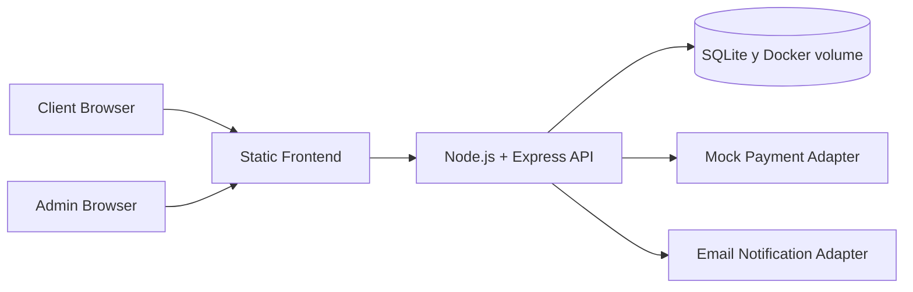
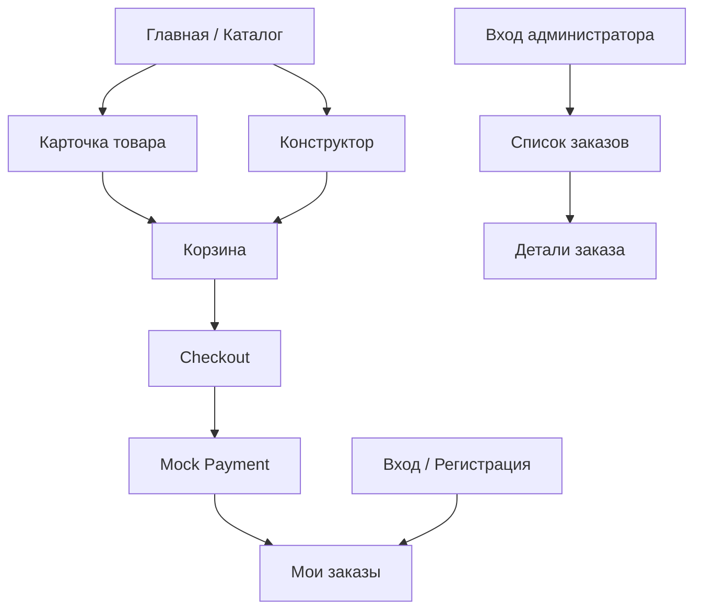

# System Overview

## Назначение системы

Система предназначена для продажи авторских украшений через веб-интерфейс. Пользователь может выбрать готовое изделие из каталога или собрать собственный вариант в конструкторе, увидеть 2D-превью, получить точную стоимость, оформить заказ и оплатить его. Администратор обрабатывает заказы и переводит их по жизненному циклу выполнения.

## Акторы

| Актор | Описание | Основные действия |
| --- | --- | --- |
| `Client` | Покупатель, использующий публичный сайт | Регистрация, вход, просмотр каталога, работа с конструктором, корзина, checkout, просмотр своих заказов |
| `Admin` | Мастер или владелец бренда с привилегированной ролью | Вход в админку, просмотр заказов, просмотр деталей заказа, смена статусов |
| `Mock Payment Provider` | Внутренний адаптер для MVP | Подтверждение оплаты без интеграции с внешним платёжным шлюзом |
| `Email Adapter` | Внутренний сервис уведомлений | Отправка уведомлений при смене статуса заказа |

## Контекст системы

## Архитектурный стиль

- Один backend-сервис.
- Одна основная база данных SQLite, сохранённая в Docker volume.
- Статический фронтенд с ES modules.
- API-first контракт между клиентом и сервером.
- Бизнес-правила и расчёт цены исполняются на сервере.

## Модули системы

| Модуль | Ответственность | Входит в MVP |
| --- | --- | --- |
| `auth` | Регистрация, вход, выход, сессии, роли | Да |
| `catalog` | Каталог активных товаров и карточка товара | Да |
| `constructor` | Конфигуратор типов украшений, опций и preview-слоёв | Да |
| `pricing` | Валидация конфигурации и расчёт стоимости | Да |
| `cart` | Активная корзина пользователя и её элементы | Да |
| `checkout` | Создание заказа из корзины, фиксация согласий, платёжный запуск | Да |
| `orders` | Кабинет клиента и получение деталей своих заказов | Да |
| `admin-orders` | Список заказов, детали заказа, перевод по статусам | Да |
| `admin-catalog` | CRUD товаров, материалов, изображений и constructor option values | Да |
| `admin-constructor` | CRUD типов, вариантов, слотов, камней и матрицы доступности | Да |
| `admin-assets` | Справочник ассетов и загрузка preview/product изображений | Да |
| `notifications` | Email-уведомления и журнал отправок | Да |
| `i18n` | Работа с локалью `uk/en` и текстовыми ресурсами | Да |

## Пользовательские потоки

### 1. Каталог готовых украшений

1. Клиент открывает каталог.
2. Фронтенд запрашивает только активные товары.
3. Клиент открывает карточку конкретного товара.
4. Сервер возвращает описание, изображения, цену и признак доступности к заказу.
5. Товар может быть добавлен в корзину как `ready_product`.

### 2. Сборка украшения в конструкторе

1. Клиент открывает страницу конструктора.
2. Фронтенд загружает конфиг типов украшений, опций и доступных значений.
3. Клиент выбирает тип украшения, материал, длину и другие параметры.
4. Клиентское приложение обновляет layered preview мгновенно.
5. При каждом значимом изменении выполняется серверный пересчёт цены.
6. Добавление в корзину разрешается только после проверки обязательных параметров.

### 3. Оформление заказа

1. Клиент просматривает корзину.
2. На checkout вводит контактные данные и выбирает доставку.
3. Обязательно отмечает согласие с офертой и условиями возврата.
4. Сервер создаёт заказ со статусом `created_pending_payment`.
5. Клиент проходит mock-оплату.
6. После успешной оплаты заказ получает статус `confirmed`.

### 4. Работа администратора

1. Администратор входит через отдельный экран входа.
2. Получает список заказов.
3. Открывает детали заказа.
4. Меняет статус строго последовательно.
5. После смены статуса формируется запись в истории и отправляется email-событие.
6. При необходимости обновляет каталог, материалы, ассеты и настройки конструктора через отдельные admin-экраны.

## Карта экранов

## Интеграции

### SQLite

- хранит пользователей, сессии, каталог, материалы, конфиг конструктора, корзины, заказы, платежи и историю статусов;
- выступает единственным постоянным хранилищем MVP в Docker-first запуске.

### Mock payment adapter

- реализует тот же контракт, что и будущий реальный платёжный провайдер;
- принимает команду подтверждения оплаты;
- возвращает детерминированный успешный или ошибочный результат;
- пишет аудит в таблицу `payments`.

### Email adapter

- принимает событие смены статуса;
- строит письмо по шаблону и выбранной локали;
- пишет результат в `notification_logs`;
- не откатывает изменение статуса, если доставка письма не удалась.

## Сквозные решения

### Авторизация и роли

- Клиент и администратор используют одну модель пользователя с разными ролями.
- Доступ к административным endpoint-ам и экранам ограничен ролью `admin`.
- Аутентификация строится на серверных сессиях и `httpOnly` cookie.

### Локализация

- Контент архитектурной документации ведётся на русском.
- Интерфейс продукта проектируется с поддержкой `uk` и `en`.
- Товары, материалы и опции конструктора хранят мультиязычные названия.

### Жизненный цикл заказа

- `created_pending_payment` — заказ создан, но не оплачен;
- `confirmed` — оплата прошла, заказ подтверждён;
- `in_progress` — мастер принял заказ в работу;
- `completed` — заказ выполнен.

Переходы через статусную модель строго линейные. Пропуск этапов запрещён.

### Overdue

Признак `overdue` рассчитывается динамически:

- заказ находится в `in_progress`;
- с момента перехода в `in_progress` прошло более 14 календарных дней.

Он используется в API и UI как вычисляемый индикатор, а не как отдельный статус в базе.

## Что оставлено за рамками текущей версии

- реальная платёжная интеграция;
- 3D-визуализация;
- внутренняя переписка клиента с мастером;
- мобильное приложение;
- сложная CRM-функциональность;
- расширенная аналитика продаж и отчёты;
- массовый импорт товаров и материалов.
