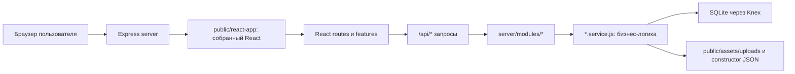

# Учебный гайд по проекту Aurora Atelier

Этот документ нужен как конспект перед защитой диплома. Его можно читать с нуля: сначала понять идею сайта, потом архитектуру, потом пройтись по основным пользовательским сценариям и, наконец, подготовиться к вопросам комиссии.

Актуальное состояние проекта на 03.06.2026: сайт запускается Docker-first, backend работает на Node.js + Express, frontend собран на React + Vite, база данных SQLite лежит в Docker volume как `/app/data/aurora.sqlite3`.

## 1. Что это за проект

`Aurora Atelier` - это веб-система для продажи авторских украшений. Пользователь может:

- смотреть главную страницу и информацию о бренде;
- просматривать каталог готовых украшений;
- открывать карточку товара;
- выбирать размер готового изделия;
- собирать собственное украшение в конструкторе;
- видеть 2D-предпросмотр с выбранными камнями;
- добавлять готовые товары и custom design в корзину;
- оформлять заказ;
- проходить mock-оплату;
- смотреть свои заказы;
- пользоваться украинской и английской локалью.

Администратор может:

- входить в admin-зону;
- смотреть заказы;
- открывать детали заказа;
- менять статус заказа по разрешенной цепочке;
- управлять товарами каталога;
- управлять данными конструктора: типами украшений, вариантами, слотами, камнями, ценами и ассетами.

Главная идея диплома: это не просто витрина, а полноценный MVP e-commerce системы с кастомным конструктором украшений, серверной валидацией цены, корзиной, заказами, оплатой-заглушкой и admin-интерфейсом.

## 2. Технологии

| Слой | Технологии | Зачем |
| --- | --- | --- |
| Frontend | React 18, Vite, CSS modules-by-domain, lucide-react | SPA-интерфейс сайта и админки |
| Backend | Node.js, Express | API, бизнес-логика, отдача React-приложения |
| Database | SQLite, Knex | хранение пользователей, товаров, корзин, заказов, конструктора |
| Auth | httpOnly cookie, server sessions, bcryptjs | безопасный вход клиента и админа |
| Payments | mock payment adapter | имитация платежного провайдера для MVP |
| Emails | nodemailer adapter + notification logs | уведомления о статусах заказов |
| Tests | Vitest, Supertest | unit и integration проверки |
| Runtime | Docker Compose | воспроизводимый запуск проекта и базы |

## 3. Как запустить проект

Основной способ запуска для диплома - через Docker:

```bash
docker compose up --build -d app
```

После запуска сайт доступен по адресу:

```text
http://localhost:3000
```

Если нужно выполнить миграции и seed внутри Docker volume:

```bash
docker compose --profile tools run --rm seed
```

Важный момент: база данных в Docker не должна быть случайным локальным файлом в корне проекта. В актуальной архитектуре она хранится в volume и внутри контейнера доступна по пути:

```text
/app/data/aurora.sqlite3
```

Переменные Docker для базы:

```text
DB_CLIENT=sqlite3
DB_FILENAME=/app/data/aurora.sqlite3
DB_DEBUG=false
```

Проверка, что backend жив:

```bash
curl.exe -s -i http://localhost:3000/api/health
```

Проверка, что неизвестный API возвращает JSON 404:

```bash
curl.exe -s -i http://localhost:3000/api/definitely-missing
```

## 4. Команды разработки и проверки

| Команда | Что делает |
| --- | --- |
| `npm run dev` | запускает Express через nodemon |
| `npm run dev:client` | запускает Vite dev server для frontend |
| `npm run build:client` | собирает React-приложение в `public/react-app` |
| `npm run build` | алиас на сборку клиента |
| `npm start` | запускает production-like Express server |
| `npm test` | запускает все Vitest тесты |
| `npm run db:migrate` | применяет миграции Knex |
| `npm run db:seed` | заполняет демо-данные |
| `npm run db:reset` | откатывает, мигрирует и сидит базу заново |

Для защиты обычно достаточно показать:

```bash
npm test
npm run build:client
docker compose up --build -d app
```

## 5. Общая архитектура

Система устроена как классическая SPA поверх API:



Главное правило архитектуры:

- `client/src/routes/*` держат страницы, загрузку данных, navigation и orchestration;
- `client/src/features/*` держат маленькие UI-компоненты и helpers по доменам;
- `server/modules/*/*.routes.js` описывают HTTP-контракт;
- `server/modules/*/*.service.js` держат бизнес-логику;
- `db/migrations/*` описывают схему базы;
- `db/seeds/*` создают демо-данные;
- большие default/config данные вынесены отдельно от CRUD и store logic.

## 6. Карта папок

| Путь | Что лежит внутри |
| --- | --- |
| `client/src/main.jsx` | вход React-приложения и таблица client routes |
| `client/src/routes/` | страницы сайта: catalog, cart, checkout, admin и т.д. |
| `client/src/features/` | переиспользуемые компоненты и helpers по доменам |
| `client/src/styles.css` | общий CSS: tokens, base, shared preview/control правила |
| `client/src/styles/*.css` | стили конкретных страниц или доменов |
| `client/src/api.js` | единая клиентская обертка над `fetch` и API-методы |
| `server/app.js` | сборка Express app, middleware, static, API и SPA routes |
| `server/routes/index.js` | подключение всех `/api/*` router'ов |
| `server/routes/pages.js` | отдача React index.html для прямого открытия страниц |
| `server/modules/` | backend-домены: auth, catalog, cart, orders, constructor |
| `server/middlewares/` | ошибки, auth, security headers, request context |
| `server/constants/` | статусы заказов, роли, типы cart items |
| `server/utils/` | общие серверные helpers |
| `db/migrations/` | структура базы |
| `db/seeds/` | демо-данные |
| `public/assets/` | картинки, product assets, uploads |
| `public/react-app/` | собранный React frontend |
| `docs/` | документация проекта |
| `tests/` | unit и integration тесты |

## 7. Как проходит HTTP-запрос

Пример: пользователь открывает `/catalog`.

1. Browser делает GET `/catalog`.
2. Express в `server/routes/pages.js` отдает `public/react-app/index.html`.
3. React запускается из `client/src/main.jsx`.
4. `resolveRouteComponent("/catalog")` выбирает `CatalogRoute`.
5. `CatalogRoute` через `catalogApi.listProducts(...)` вызывает `/api/catalog/products`.
6. Express направляет запрос в `server/modules/catalog/catalog.routes.js`.
7. Route вызывает `catalog.service.js`.
8. Service читает SQLite через Knex, применяет фильтры, форматирует ответ.
9. API возвращает JSON.
10. React показывает товары.

То же правило работает для остальных страниц: route-компонент отвечает за UI-flow, API route принимает запрос, service выполняет бизнес-логику.

## 8. Frontend: вход и маршруты

Главный файл frontend:

```text
client/src/main.jsx
```

Там есть массив `ROUTE_DEFINITIONS`. Он связывает URL со страницей:

| URL | React route |
| --- | --- |
| `/` | `home-route.jsx` |
| `/catalog` | `catalog-route.jsx` |
| `/products/:slug` | `product-route.jsx` |
| `/constructor` | `constructor-route.jsx` |
| `/cart` | `cart-route.jsx` |
| `/checkout` | `checkout-route.jsx` |
| `/payment/:orderId` | `payment-route.jsx` |
| `/orders` | `orders-route.jsx` |
| `/orders/:id` | `order-detail-route.jsx` |
| `/auth` | `auth-route.jsx` |
| `/account` | `account-route.jsx` |
| `/admin/login` | `admin-login-route.jsx` |
| `/admin/orders` | `admin-orders-route.jsx` |
| `/admin/orders/:id` | `admin-order-detail-route.jsx` |
| `/admin/products` | `admin-products-route.jsx` |
| `/admin/constructor` | `admin-constructor-route.jsx` |

Почему это важно на защите: можно объяснить, что проект не использует хаотичный `if/else` или длинный ternary. Маршрутизация оформлена таблицей, поэтому новую страницу добавить просто: добавить lazy import и запись в `ROUTE_DEFINITIONS`.

## 9. Frontend: API layer

Файл:

```text
client/src/api.js
```

Он делает три важные вещи:

1. Имеет общую функцию `http(url, options)`.
2. Всегда отправляет cookie через `credentials: "include"`, чтобы работали server sessions.
3. Добавляет локаль через header `x-locale` и query `lang`.

API сгруппированы по доменам:

| Объект | За что отвечает |
| --- | --- |
| `catalogApi` | товары каталога, карточка товара, facets для фильтров |
| `cartApi` | корзина, позиции, промокод |
| `constructorApi` | типы, варианты, опции варианта, расчет цены |
| `authApi` | сессия, регистрация, login/logout, Google, email verification, admin login |
| `accountApi` | dashboard аккаунта |
| `ordersApi` | мои заказы, checkout, mock payment |
| `adminOrdersApi` | список заказов, детали, смена статуса |
| `adminCatalogApi` | admin catalog, assets и admin constructor |

Если комиссия спрашивает “где frontend общается с backend”, ответ: вся клиентская работа с API централизована в `client/src/api.js`.

## 10. Frontend: layout, features и стили

### Public shell

`client/src/routes/public-shell.jsx` отвечает за общий каркас публичных страниц: header, footer, навигацию, переключение языка.

### Features

`client/src/features/` нужен, чтобы route-файлы не становились монолитами:

| Папка | Назначение |
| --- | --- |
| `features/constructor` | публичный конструктор: страница, URL state, copy, slots UI, icons |
| `features/admin-constructor` | секции admin-конструктора, slot editor, helpers workspace |
| `features/cart` | guest cart и события счетчика корзины |
| `features/orders` | форматирование заказов, preview custom design, статусы |
| `features/home` | секции главной страницы и showcase конструктора |
| `features/legal` | страницы оферты, возврата, privacy |
| `features/admin` | shell админки и формы товаров |

### CSS

Стили специально разбиты:

| Файл | Роль |
| --- | --- |
| `client/src/styles.css` | общий слой: переменные, base, shared preview/control стили |
| `client/src/styles/constructor-page.css` | публичный конструктор |
| `client/src/styles/admin-constructor.css` | admin constructor |
| `client/src/styles/catalog-page.css` | каталог |
| `client/src/styles/checkout-payment.css` | checkout и payment |
| `client/src/styles/home-sections.css` | главная |
| `client/src/styles/orders-account.css` | account, orders, order detail |
| `client/src/styles/auth-page.css` | login/register |
| `client/src/styles/legal-pages.css` | legal pages |
| `client/src/styles/public-footer.css` | footer |

Важное правило: `.studio-preview-*` правила для `JewelryPreview` лежат в общем `styles.css`, потому что preview используется не только в admin, но и в публичном конструкторе, корзине, заказах и home showcase.

## 11. Backend: Express app

Главный файл backend-приложения:

```text
server/app.js
```

Порядок подключения:

1. Создается `express()`.
2. Отключается `x-powered-by`.
3. Подключаются body parsers.
4. Подключается `cookieParser`.
5. Добавляется request context.
6. Добавляются security headers.
7. Подключается session user из cookie.
8. Отдается favicon.
9. Отдается static из `public`.
10. Есть `/api/health`.
11. Подключаются API routes.
12. Подключаются SPA page routes.
13. В конце стоят `notFoundHandler` и `errorHandler`.

Почему `/api/*` и публичные страницы не конфликтуют:

- API подключается через `server/routes/index.js`;
- page routes подключаются через `server/routes/pages.js`;
- неизвестный `/api/*` доходит до JSON `notFoundHandler`;
- неизвестный public URL получает React app, а React показывает собственную 404-страницу.

## 12. Backend: API modules

Все API подключаются в:

```text
server/routes/index.js
```

| API prefix | Router | Назначение |
| --- | --- | --- |
| `/api/auth` | `auth.routes.js` | клиентская регистрация, login, logout, session |
| `/api/admin` | `admin-auth.routes.js` | вход администратора |
| `/api/catalog` | `catalog.routes.js` | публичный каталог |
| `/api/constructor` | `constructor.routes.js` | публичный конструктор |
| `/api/cart` | `cart.routes.js` | корзина |
| `/api/checkout` | `checkout.routes.js` | создание заказа |
| `/api/payments` | `payments.routes.js` | mock payment |
| `/api/orders` | `orders.routes.js` | заказы клиента |
| `/api/account` | `account.routes.js` | кабинет клиента |
| `/api/admin/orders` | `admin-orders.routes.js` | управление заказами |
| `/api/admin/catalog` | `admin-catalog.routes.js` | управление товарами |
| `/api/admin/constructor` | `admin-constructor.routes.js` | управление конструктором |
| `/api/admin/assets` | `admin-assets.routes.js` | загрузки и ассеты |

Паттерн в каждом модуле:

```text
*.routes.js  -> HTTP-контракт
*.service.js -> бизнес-логика
```

Route не должен делать сложные расчеты. Он принимает `req`, вызывает service и возвращает JSON.

## 13. База данных

База работает через:

```text
server/db/knex.js
knexfile.cjs
db/migrations/*
db/seeds/01_demo_data.js
```

Основные группы таблиц:

| Группа | Таблицы |
| --- | --- |
| Auth | `users`, `sessions`, `email_verification_codes` |
| Catalog | `jewelry_types`, `products`, `product_images`, `materials` |
| Legacy constructor schema | `design_options`, `design_option_values` |
| Cart | `carts`, `cart_items` |
| Checkout/orders | `orders`, `order_items`, `order_status_history` |
| Payments | `payments` |
| Notifications | `notification_logs` |
| Promo | `promo_codes`, `promo_code_redemptions`, `promo_code_user_usage` |

Важные инварианты:

- пользователь имеет роль `client` или `admin`;
- сессии хранятся на сервере, в cookie лежит только идентификатор/токен;
- пароль хранится только как hash;
- у пользователя должна быть только одна активная корзина;
- позиция корзины имеет тип `ready_product` или `custom_design`;
- заказ создается из корзины;
- заказ не должен перескакивать через статусы;
- mock payment создает запись в `payments`;
- смена статуса заказа пишет историю в `order_status_history`;
- уведомления пишутся в `notification_logs`.

## 14. Демо-данные

Главный seed:

```text
db/seeds/01_demo_data.js
```

Он готовит проект к демонстрации:

- создает admin-пользователя;
- создает client-пользователя;
- наполняет каталог товарами;
- создает материалы;
- создает demo cart/orders;
- поднимает данные для конструктора;
- создает промокод `WELCOME10`.

Каталог готовых товаров централизован в:

```text
db/catalog-products.js
```

Это важно: товары не разбросаны по разным файлам. Seed берет данные из одного источника.

## 15. Сценарий 1: каталог готовых товаров

Пользовательский путь:

```text
/catalog -> фильтры -> карточка товара -> выбор размера -> корзина
```

Frontend:

- `client/src/routes/catalog-route.jsx` - список товаров, фильтры, toolbar;
- `client/src/routes/product-route.jsx` - карточка товара;
- `client/src/styles/catalog-page.css` - стили каталога;
- `client/src/ready-product.js` - helpers для ready product и размеров.

API:

- `GET /api/catalog/products`;
- `GET /api/catalog/products/facets`;
- `GET /api/catalog/products/:identifier`.

Backend:

- `server/modules/catalog/catalog.routes.js`;
- `server/modules/catalog/catalog.service.js`;
- `server/modules/catalog/catalog.filters.js`;
- `server/utils/product-image.js`.

База:

- `products`;
- `product_images`;
- `jewelry_types`;
- `materials`.

Что говорить на защите: каталог не просто показывает статичный массив. Backend фильтрует товары, отдает локализованные поля, проверяет изображения и возвращает fallback, если реальный asset отсутствует.

## 16. Сценарий 2: публичный конструктор

Пользовательский путь:

```text
/constructor -> тип украшения -> вариант -> материал -> камни -> размер -> гравировка -> расчет цены -> корзина
```

Frontend:

- `client/src/routes/constructor-route.jsx` - тонкий route-shell;
- `client/src/features/constructor/constructor-studio-page.jsx` - основная рабочая страница;
- `client/src/features/constructor/constructor-url-state.js` - синхронизация `type` и `variant` в URL;
- `client/src/features/constructor/studio-constructor-slots.jsx` - выбор камней по слотам;
- `client/src/features/constructor/type-icon.jsx` - иконки типов украшений;
- `client/src/jewelry-preview.jsx` - общий preview-компонент;
- `client/src/styles/constructor-page.css` - стили страницы.

API:

- `GET /api/constructor/types`;
- `GET /api/constructor/variants?type_id=...`;
- `GET /api/constructor/variants/:variantId/options`;
- `POST /api/constructor/price`.

Backend:

- `server/modules/constructor/constructor.routes.js`;
- `server/modules/constructor/constructor.service.js`;
- `server/modules/pricing/pricing.service.js`;
- `server/modules/constructor/constructor-json.service.js`;
- `server/modules/constructor/constructor-pricing.service.js`.

Данные конструктора:

- `constructor-default-data.js` - стартовые типы, варианты, камни, слоты, матрица цен;
- `constructor-json.store.js` - read/write/init JSON-хранилища конструктора;
- `constructor-normalizers.js` - нормализация входных данных;
- `constructor-assets.service.js` - ассеты;
- `constructor-admin-crud.service.js` - CRUD для админки.

Как работает preview:

1. Вариант украшения имеет base asset.
2. Слоты задают координаты камней в процентах.
3. Пользователь выбирает камень для каждого слота.
4. `JewelryPreview` рисует base canvas и overlay-камни.
5. CSS `.studio-preview-*` собирает слои в квадратный preview.

Как считается цена:

1. Frontend отправляет `jewelry_type_id` и `configuration`.
2. Backend проверяет тип, вариант, материал, размер, камни.
3. Цена складывается из базовой цены, дельты варианта, материала, размера, камней и других правил.
4. Backend возвращает `is_valid`, `price`, `currency`, breakdown.
5. Кнопка добавления в корзину доступна только когда конфигурация валидна.

Что говорить на защите: клиентский preview нужен для удобства, но финальная цена и валидность считаются на сервере. Это защищает систему от подмены цены в браузере.

## 17. Сценарий 3: корзина

Пользовательский путь:

```text
готовый товар или custom design -> add to cart -> /cart -> изменение количества -> promo code -> checkout
```

Frontend:

- `client/src/routes/cart-route.jsx`;
- `client/src/features/cart/guest-cart.js`;
- `client/src/features/cart/cart-events.js`;
- `client/src/features/orders/order-preview.jsx`.

API:

- `GET /api/cart`;
- `POST /api/cart/items`;
- `PATCH /api/cart/items/:itemId`;
- `DELETE /api/cart/items/:itemId`;
- `POST /api/cart/promo-code`;
- `DELETE /api/cart/promo-code`;

Backend:

- `server/modules/cart/cart.routes.js`;
- `server/modules/cart/cart.service.js`;
- `server/modules/promotions/promo-codes.service.js`.

База:

- `carts`;
- `cart_items`;
- `promo_codes`;
- `promo_code_user_usage`;
- `promo_code_redemptions`.

Типы позиций:

- `ready_product` - готовый товар из каталога;
- `custom_design` - изделие из конструктора с `configuration_json`.

Особенность: для незалогиненного пользователя публичный конструктор может использовать guest cart в `localStorage`. Для авторизованного пользователя корзина хранится на сервере.

## 18. Сценарий 4: checkout и mock payment

Пользовательский путь:

```text
/cart -> /checkout -> создание заказа -> /payment/:orderId -> mock confirm -> /orders/:id
```

Frontend:

- `client/src/routes/checkout-route.jsx`;
- `client/src/routes/payment-route.jsx`;
- `client/src/styles/checkout-payment.css`.

API:

- `POST /api/checkout`;
- `POST /api/payments/mock/confirm`;
- `GET /api/orders/:id`.

Backend:

- `server/modules/checkout/checkout.routes.js`;
- `server/modules/checkout/checkout.service.js`;
- `server/modules/payments/payments.routes.js`;
- `server/modules/payments/payments.service.js`;
- `server/modules/notifications/notifications.service.js`.

База:

- `orders`;
- `order_items`;
- `payments`;
- `order_status_history`;
- `notification_logs`.

Как создается заказ:

1. Пользователь вводит контактные данные.
2. Пользователь принимает оферту и условия возврата.
3. Backend валидирует payload.
4. Backend переносит позиции из active cart в `order_items`.
5. Создается заказ со статусом `created_pending_payment`.
6. Корзина получает статус `checked_out`.
7. Создается pending payment.
8. Пользователь попадает на страницу mock payment.

Как подтверждается оплата:

1. Frontend отправляет `order_id` и `payment_token`.
2. Backend проверяет, что заказ принадлежит пользователю.
3. Payment меняется на `succeeded`.
4. Заказ меняется на `confirmed`.
5. Пишется история статуса.
6. Создается notification log.

Что говорить на защите: mock payment сделан как adapter. Это не настоящая платежная система, но архитектурно место интеграции уже выделено, поэтому реального провайдера можно подключить позже.

## 19. Сценарий 5: регистрация, вход и сессия

Frontend:

- `client/src/routes/auth-route.jsx`;
- `client/src/routes/admin-login-route.jsx`;
- `client/src/styles/auth-page.css`.

API:

- `GET /api/auth/session`;
- `POST /api/auth/register`;
- `POST /api/auth/login`;
- `POST /api/auth/logout`;
- `GET /api/auth/google/config`;
- `POST /api/auth/google`;
- `POST /api/auth/verify-email`;
- `POST /api/auth/resend-verification`;
- `POST /api/admin/login`.

Backend:

- `server/modules/auth/auth.routes.js`;
- `server/modules/auth/admin-auth.routes.js`;
- `server/modules/auth/auth.service.js`;
- `server/middlewares/session-auth.js`;
- `server/middlewares/auth.js`.

База:

- `users`;
- `sessions`;
- `email_verification_codes`.

Важные детали:

- пароль хранится как bcrypt hash;
- cookie httpOnly, frontend не читает токен напрямую;
- `attachSessionUser` добавляет пользователя в `req.user`;
- admin endpoints требуют роль `admin`;
- клиентская и admin-авторизация используют общую таблицу пользователей, но разные проверки роли.

## 20. Сценарий 6: заказы клиента

Frontend:

- `client/src/routes/orders-route.jsx`;
- `client/src/routes/order-detail-route.jsx`;
- `client/src/features/orders/order-status.js`;
- `client/src/features/orders/order-format.js`;
- `client/src/features/orders/order-preview.jsx`;
- `client/src/styles/orders-account.css`.

API:

- `GET /api/orders/me`;
- `GET /api/orders/:id`;

Backend:

- `server/modules/orders/orders.routes.js`;
- `server/modules/orders/orders.service.js`.

Что важно:

- клиент видит только свои заказы;
- детали заказа содержат позиции, оплату, историю и active payment token только пока оплата pending;
- custom design в заказе показывает preview из сохраненной конфигурации.

## 21. Сценарий 7: admin orders

Frontend:

- `client/src/routes/admin-orders-route.jsx`;
- `client/src/routes/admin-order-detail-route.jsx`;
- `client/src/features/admin/admin-shell.jsx`.

API:

- `GET /api/admin/orders`;
- `GET /api/admin/orders/:id`;
- `PATCH /api/admin/orders/:id/status`;

Backend:

- `server/modules/admin-orders/admin-orders.routes.js`;
- `server/modules/admin-orders/admin-orders.service.js`;
- `server/constants/order-statuses.js`.

Статусы заказа:

```text
created_pending_payment -> confirmed -> in_progress -> completed
```

Правила:

- нельзя перескакивать вперед через этап;
- откат назад разрешен только на соседний статус;
- для отката нужен комментарий;
- история смены статуса сохраняется;
- при смене статуса создается уведомление.

Что говорить на защите: жизненный цикл заказа реализован как строгая finite state flow. Это уменьшает риск случайно поставить заказ в неправильное состояние.

## 22. Сценарий 8: admin catalog

Frontend:

- `client/src/routes/admin-products-route.jsx`;
- `client/src/features/admin/product-form.js`;
- `client/src/features/admin/admin-shell.jsx`.

API:

- `GET /api/admin/catalog/jewelry-types`;
- `GET /api/admin/catalog/products`;
- `POST /api/admin/catalog/products`;
- `PATCH /api/admin/catalog/products/:productId`;
- `DELETE /api/admin/catalog/products/:productId`;
- `POST /api/admin/catalog/uploads/product-image`;
- `GET /api/admin/catalog/materials`.

Backend:

- `server/modules/admin-catalog/admin-catalog.routes.js`;
- `server/modules/admin-catalog/admin-catalog.service.js`;
- `server/modules/admin-assets/admin-assets.routes.js`;

Что важно:

- удаление товаров обычно мягкое через `is_active`;
- изображения хранятся в `public/assets/uploads`;
- Docker volume `aurora-uploads` сохраняет загруженные файлы между пересозданиями контейнера.

## 23. Сценарий 9: admin constructor

Frontend:

- `client/src/routes/admin-constructor-route.jsx` - route orchestration;
- `client/src/features/admin-constructor/library-sections.jsx` - compatibility re-export;
- `client/src/features/admin-constructor/stone-sections.jsx`;
- `client/src/features/admin-constructor/jewelry-sections.jsx`;
- `client/src/features/admin-constructor/pricing-sections.jsx`;
- `client/src/features/admin-constructor/workspace-sections.jsx`;
- `client/src/features/admin-constructor/asset-sections.jsx`;
- `client/src/features/admin-constructor/studio-slot-canvas-editor.jsx`;
- `client/src/features/admin-constructor/slot-draft.js`;
- `client/src/features/admin-constructor/location-sync.js`;
- `client/src/features/admin-constructor/studio-navigation.js`;
- `client/src/styles/admin-constructor.css`.

API:

- `GET /api/admin/constructor`;
- `POST /api/admin/constructor/types`;
- `PATCH /api/admin/constructor/types/:typeId`;
- `DELETE /api/admin/constructor/types/:typeId`;
- `POST /api/admin/constructor/variants`;
- `PATCH /api/admin/constructor/variants/:variantId`;
- `DELETE /api/admin/constructor/variants/:variantId`;
- `POST /api/admin/constructor/slots`;
- `PATCH /api/admin/constructor/slots/:slotId`;
- `DELETE /api/admin/constructor/slots/:slotId`;
- `POST /api/admin/constructor/stones`;
- `PATCH /api/admin/constructor/stones/:stoneId`;
- `DELETE /api/admin/constructor/stones/:stoneId`;
- `PATCH /api/admin/constructor/variant-stones`;
- `DELETE /api/admin/constructor/variant-stones/:variantId/:stoneId`.

Backend:

- `server/modules/admin-constructor/admin-constructor.routes.js`;
- `server/modules/constructor/constructor-json.service.js`;
- `server/modules/constructor/constructor-admin-crud.service.js`;
- `server/modules/constructor/constructor-assets.service.js`;
- `server/modules/constructor/constructor-json.store.js`.

Что делает admin constructor:

- редактирует типы украшений;
- редактирует варианты;
- задает слоты камней;
- управляет координатами камней на preview;
- управляет доступными камнями;
- задает price delta для камней в конкретном варианте;
- управляет ассетами.

Что говорить на защите: раньше это был один большой монолитный экран, но он разбит на feature-секции. Route держит state и orchestration, а UI-секции вынесены в маленькие файлы.

## 24. Constructor JSON subsystem

Конструктор сейчас использует отдельный JSON/store слой для гибкости admin-настроек.

| Файл | Роль |
| --- | --- |
| `constructor-default-data.js` | стартовые данные конструктора |
| `constructor-json.store.js` | чтение, инициализация, запись JSON-данных |
| `constructor-json.service.js` | фасад, который собирает остальные сервисы |
| `constructor-normalizers.js` | нормализация входных данных |
| `constructor-pricing.service.js` | расчет цены конструктора |
| `constructor-assets.service.js` | работа с ассетами |
| `constructor-admin-crud.service.js` | CRUD для admin constructor |
| `layouts.store.js` | дополнительные layout данные |

Почему фасад полезен:

- старые импорты не ломаются;
- внешний API модуля остается стабильным;
- внутри логика разделена на понятные зоны ответственности;
- легче объяснять код комиссии.

## 25. JewelryPreview

Файл:

```text
client/src/jewelry-preview.jsx
```

Это общий компонент preview для украшений. Он используется:

- в публичном конструкторе;
- в home showcase;
- в корзине;
- в деталях заказа;
- в admin constructor.

Основные идеи:

- base asset рисуется в canvas;
- цвет металла может корректироваться программно;
- камни накладываются отдельными absolutely-positioned слоями;
- слоты используют проценты, поэтому preview масштабируется;
- CSS `.studio-preview-*` должен быть общим.

Если на защите спросят, почему preview не 3D: для MVP выбран 2D-layered preview, потому что он проще, быстрее, понятнее для диплома и достаточно показывает выбранные элементы.

## 26. Локализация

Проект поддерживает `uk` и `en`.

Где смотреть:

- `client/src/i18n/public-copy.js`;
- `client/src/i18n/admin-copy.js`;
- `client/src/content.js`;
- `server/modules/i18n/i18n.service.js`;
- поля базы `name_uk`, `name_en`, `description_uk`, `description_en`.

Frontend хранит выбранную локаль в `localStorage` под ключом:

```text
aurora-locale
```

`client/src/api.js` отправляет локаль в API через:

- query `lang`;
- header `x-locale`.

Backend через locale helpers выбирает нужные локализованные поля.

## 27. Безопасность и валидация

Что уже есть:

- `httpOnly` cookie для сессий;
- password hash через bcrypt;
- role-based access для admin;
- security headers в `server/middlewares/security.js`;
- централизованный error handler;
- request id через request context;
- rate limit middleware;
- серверная валидация checkout;
- серверная валидация цены конструктора;
- запрет невалидных переходов статуса заказа.

Что важно объяснить: frontend может улучшать UX, но критичные решения принимаются на сервере. Цена, статус заказа, права доступа и checkout-валидация не доверяют браузеру.

## 28. Ошибки и формат JSON

Успешный API-ответ выглядит так:

```json
{
  "success": true,
  "data": {}
}
```

Ошибка выглядит так:

```json
{
  "success": false,
  "error": {
    "code": "VALIDATION_ERROR",
    "message": "Validation failed",
    "details": {}
  }
}
```

Клиентская функция `http(...)` в `client/src/api.js` проверяет `response.ok` и `payload.success`. Если что-то не так, она бросает `Error`, а route-компонент показывает сообщение пользователю.

## 29. Тесты

Папка:

```text
tests/
```

Основные группы:

| Файл | Что проверяет |
| --- | --- |
| `tests/integration/api-flows.test.js` | auth, session, cart, constructor config, checkout, orders |
| `tests/integration/cart-checkout.test.js` | целостность корзины, checkout, payment, promo, admin status |
| `tests/integration/app.test.js` | базовая работа Express app |
| `tests/unit/catalog-filters.test.js` | фильтры каталога |
| `tests/unit/money.test.js` | денежные helpers |
| `tests/unit/order-statuses.test.js` | переходы статусов |
| `tests/unit/preview.test.js` | preview helpers |
| `tests/unit/promo-codes.test.js` | промокоды |

Команда:

```bash
npm test
```

Что говорить на защите: тесты не просто “проверяют функции”, а закрывают основные бизнес-сценарии: регистрация, сессия, корзина, checkout, payment idempotency, промокоды и статусную модель заказа.

## 30. Что показывать комиссии в коде

Оптимальный порядок демонстрации:

1. `docker-compose.yml` - показать Docker-first запуск и SQLite volume.
2. `server/app.js` - показать middleware pipeline, static, API, SPA routes.
3. `server/routes/index.js` - показать API modules.
4. `client/src/main.jsx` - показать route table.
5. `client/src/api.js` - показать централизованные API-клиенты.
6. `client/src/routes/constructor-route.jsx` - показать, что route стал shell.
7. `client/src/features/constructor/constructor-studio-page.jsx` - показать публичный конструктор.
8. `client/src/jewelry-preview.jsx` - показать preview.
9. `server/modules/constructor/constructor-json.service.js` - показать фасад конструктора.
10. `server/modules/constructor/constructor-pricing.service.js` - показать серверный расчет цены.
11. `server/modules/checkout/checkout.service.js` - показать оформление заказа.
12. `server/constants/order-statuses.js` - показать статусную модель.
13. `tests/integration/cart-checkout.test.js` - показать, что важные сценарии покрыты тестами.

## 31. Как отвечать на типичные вопросы

### Почему SQLite, а не MySQL/PostgreSQL?

Для дипломного MVP SQLite проще развернуть, легче демонстрировать через Docker, не нужен отдельный database service. При этом код использует Knex, поэтому архитектурно переход на другую SQL-СУБД возможен без переписывания всего приложения.

### Где хранится база?

В Docker volume. Внутри контейнера путь `/app/data/aurora.sqlite3`. Это лучше, чем случайный локальный файл, потому что данные переживают пересоздание контейнера.

### Почему frontend не считает финальную цену сам?

Frontend может показывать быстрый preview, но финальная цена считается на сервере. Это защищает от подмены цены через DevTools.

### Почему payment mock?

Потому что это MVP. Реальная интеграция платежей требует юридических и банковских настроек. В проекте уже выделен payment module и adapter-like контракт, поэтому реального провайдера можно подключить позже.

### Почему админка и публичный сайт в одном React-приложении?

Для MVP это проще в разработке и демонстрации. Разделение идет на уровне routes, API прав и роли `admin`. Admin endpoints защищены сервером.

### Что защищает admin endpoints?

Middleware авторизации и проверка роли. Даже если пользователь вручную откроет admin URL, API не отдаст данные без admin-сессии.

### Как система понимает, чей заказ показывать?

`attachSessionUser` достает пользователя из server session. `orders.service.js` возвращает клиенту только его заказы. Admin route имеет отдельную проверку роли.

### Почему код не считается монолитом?

Проект разделен по слоям:

- frontend routes;
- frontend features;
- API routes;
- backend services;
- constants/utils;
- migrations/seeds;
- domain CSS.

Крупные части конструктора уже вынесены в маленькие модули.

### Где находится бизнес-логика?

На backend в `server/modules/*/*.service.js`. Route-файлы в основном описывают HTTP-контракт.

### Что будет, если пользователь обновит `/orders/1` напрямую?

Express отдаст React app через `server/routes/pages.js`. React выберет `OrderDetailRoute` по URL и загрузит данные через API.

### Что будет, если открыть неизвестный `/api/test`?

Это API URL, поэтому он не должен отдавать React. Он вернет JSON 404 через `notFoundHandler`.

### Как работает конструктор камней?

У варианта есть слоты с координатами. Пользователь выбирает камень для слота. `JewelryPreview` накладывает выбранные камни на base asset по координатам. Цена пересчитывается сервером с учетом выбранных камней.

### Почему координаты слотов в процентах?

Так preview масштабируется: один и тот же слот работает на разных размерах контейнера, потому что позиция задана относительно квадрата.

### Что делать, если в preview снова огромная картинка?

Проверить общие CSS-правила `.studio-preview-*` в `client/src/styles.css` и constructor-only `.preview-canvas { aspect-ratio: 1 / 1; }` в `client/src/styles/constructor-page.css`.

## 32. Практический маршрут изучения за 1 день

Если времени мало, читать код так:

1. Прочитать этот файл полностью.
2. Открыть `docker-compose.yml`.
3. Открыть `server/app.js`.
4. Открыть `server/routes/index.js`.
5. Открыть `client/src/main.jsx`.
6. Открыть `client/src/api.js`.
7. Пройти публичный сценарий: `catalog-route.jsx` -> `catalog.service.js`.
8. Пройти конструктор: `constructor-route.jsx` -> `features/constructor` -> `constructor.routes.js` -> `constructor-pricing.service.js`.
9. Пройти заказ: `cart-route.jsx` -> `checkout-route.jsx` -> `checkout.service.js` -> `payments.service.js`.
10. Пройти admin: `admin-orders-route.jsx` -> `admin-orders.service.js` -> `order-statuses.js`.
11. Запустить `npm test`.
12. Запустить `docker compose up --build -d app` и пройти сайт руками.

## 33. Что проверять перед защитой

Команды:

```bash
npm test
npm run build:client
docker compose up --build -d app
curl.exe -s -i http://localhost:3000/api/definitely-missing
```

Страницы для smoke-check:

```text
/
/catalog
/constructor
/cart
/checkout
/admin/login
/admin/orders
/admin/constructor
/not-found-diploma-smoke
```

Визуально проверить:

- нет битой кириллицы `�`;
- нет красного overlay ошибки;
- нет console errors;
- preview конструктора квадратный;
- камни в конструкторе видны;
- неизвестный public URL показывает React 404;
- неизвестный `/api/*` возвращает JSON 404.

## 34. Глоссарий проекта

| Термин | Значение |
| --- | --- |
| SPA | Single Page Application: React сам выбирает страницу по URL |
| Route | файл страницы или HTTP endpoint |
| Feature | маленький frontend-модуль по домену |
| Service | backend-модуль с бизнес-логикой |
| Migration | изменение схемы базы |
| Seed | демо-данные |
| Ready product | готовый товар из каталога |
| Custom design | украшение, собранное пользователем в конструкторе |
| Slot | место на украшении, куда ставится камень |
| Stone matrix | связь “вариант украшения -> доступные камни -> доплата” |
| Base asset | базовое изображение украшения без выбранных камней |
| Mock payment | имитация оплаты |
| Notification log | запись о попытке отправить уведомление |
| Docker volume | постоянное хранилище данных контейнера |

## 35. Самая короткая версия для устного ответа

Проект Aurora Atelier - это MVP интернет-магазина авторских украшений с React SPA, Express API и SQLite в Docker volume. Frontend разделен на routes и features, backend - на routes и services. Каталог и конструктор получают данные через API, цена custom design считается на сервере, корзина и checkout сохраняются в базе, mock payment переводит заказ в `confirmed`, а admin может вести заказ по строгой статусной цепочке. Данные базы описаны миграциями Knex, демо-данные создаются seed'ом, а основные бизнес-сценарии проверяются Vitest/Supertest тестами.
